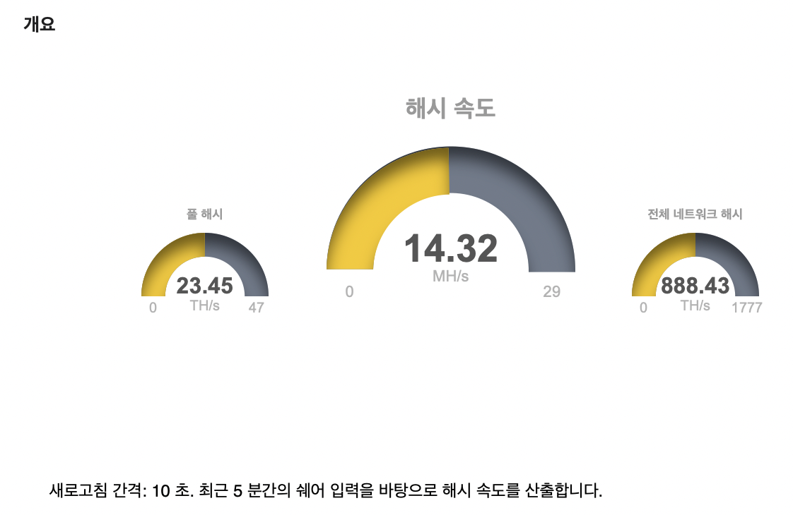

# 요약
> 압도적인 전성비, 쥐똥만한 채굴량 
> (M1 Pro 8코어 CPU 14코어 GPU, 2022.02.18 기준)

# M1 시리즈에서 채굴하기
1. **지갑, Pool 등 기본 설정**
  - 저는 마이닝 풀 허브를 이용했습니다
  - 채굴을 위한 pool 주소, id, pw, worker 정보 등을 확보해두세요

2. **Miner 다운로드**
  - 아직 M1칩셋을 위한 마이너가 많은 것 같지는 않습니다
  - 저는 기존에 널리 사용되던 ethminer를 m1용으로 포팅한 ethminer-m1의 v0.19.0-alpha.0-m1 버전을 이용했습니다.
    - 다운로드 링크 [https://github.com/gyf304/ethminer-m1/releases/tag/v0.19.0-alpha.0-m1](https://github.com/gyf304/ethminer-m1/releases/tag/v0.19.0-alpha.0-m1)
   

3. **Miner 설치**
  - 다운로드 받은 ethminer-m1파일을 Application폴더로 이동합니다.

4. **실행**
  - 터미널을 켜고 아래 명령어를 실행합니다
  ```bash
     > cd /Applications
     > ./ethminer-m1 -P stratum+tcp://(풀 주소 및 계정, Worker 이름 및 비밀번호 등)
  ``` 


  - 보안문제로 실행이 안 될때는 맥 시스템환경설정 > 보안 및 개인정보보호 > 일반에서 ether-m1을 허용해주시면 됩니다
  - 제대로 실행이 되었다면, 처음에는 0.0Mh로만 시작하는 채굴량이 나오고, 채굴량이 증가하면서 증가하는 값이 나옵니다  

  

# 효율 계산
위 스크린샷에서 보이듯, 1회 채굴량은 약 5.2Mh입니다. 이를 Pool에서 제공하는 기능을 이용해서 보면, 대략 14~15Mh/s가 됩니다.

 

대략 NVIDIA GTX1050Ti 정도의 hashrate가 나오는 것 같습니다.


전성비를 알아봅시다.  
터미널에서 아래 명령어를 입력하고 비밀번호를 입력하면 전력소모량을 볼 수 있습니다.
```bash
   > sudo /usr/bin/powermetrics
```
  
  
넉넉 6mW정도를 사용하는군요..(다만 이게 초당으로 계산해도 되는건지는 좀 더 알아봐야겠습니다만 일단 초당소모량으로 가정하겠습니다)


대략 30Mh/Watt라고 생각하면, 전성비를 따라올 GPU가 없습니다.  
왜냐하면 가장 전성비가 좋은 GPU도 0.6Mh/W입니다..(출처: [https://www.gpu-monkey.com/en/gpu_benchmark-crypto_mining_ethereum_hashrate-4](https://www.gpu-monkey.com/en/gpu_benchmark-crypto_mining_ethereum_hashrate-4))


# 현실적인 한계
전성비도 좋고 다 좋습니다...다만 15Mh/s로는 하루에 대략 0.00008~0.00009 eth정도가 채굴됩니다.


구글을 이용해서 간편계산해보면 대략 하루에 250~300원정도 될 것 같네요. M1 Max 최고사양을 사용한다고 하더라도 대략 500원 내외이지 않을까 합니다.
여기에 전기료도 고려하면...한달에 대략 1~1.5만원 내외의 수익이 될 텐데, 이게 250~300만원을 호가하는 장비에서 할 일인가 싶네요...  
  
어차피 맥 쓰는데, <b>백그라운드에 켜놓으면 되는거 아니냐!!</b> 하실 수도 있는데, 채굴은 GPU를 100% 점유하기 때문에, 채굴을 켜놓고 다른작업을 하기가 굉장히 어렵습니다..맥이 느려터지려하거든요..(CPU만 쓰는 작업은 제외이긴 한데,,GPU를 1도 안쓰는 작업이 얼마나 될까요...?)
물론 혹시 나중에 m1 칩셋 전용 miner가 나온다거나 해서 효율이 10배쯤 올라가면 해볼 수 있을 것 같습니다.


# 결론
> 맥은 맥대로 쓰고, 채굴이 하고싶으면 전용 장비를 이용하자