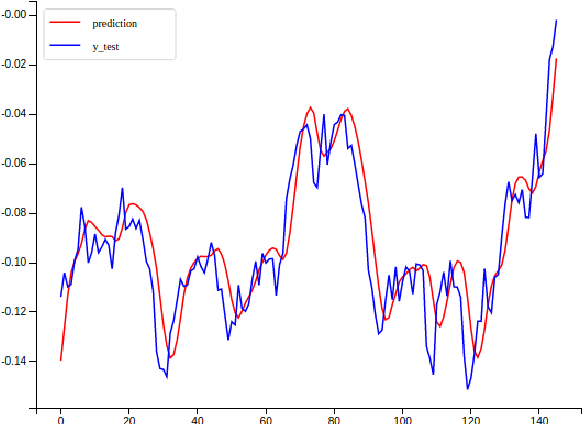
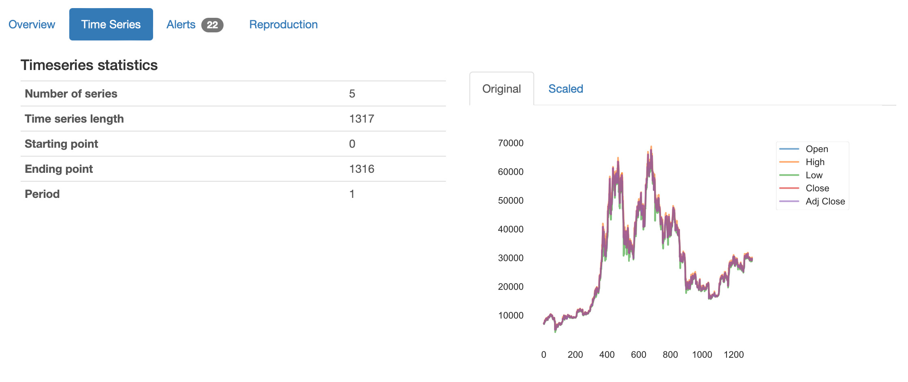
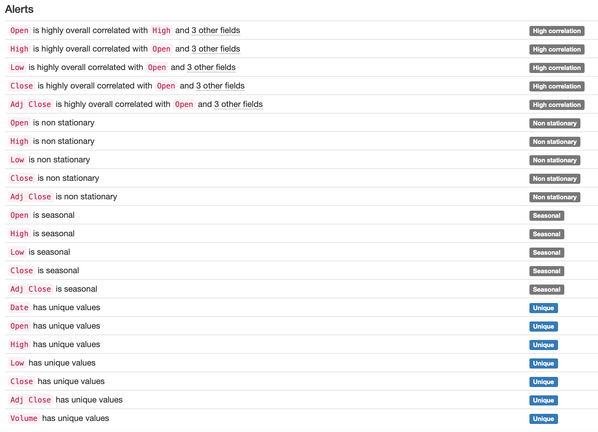
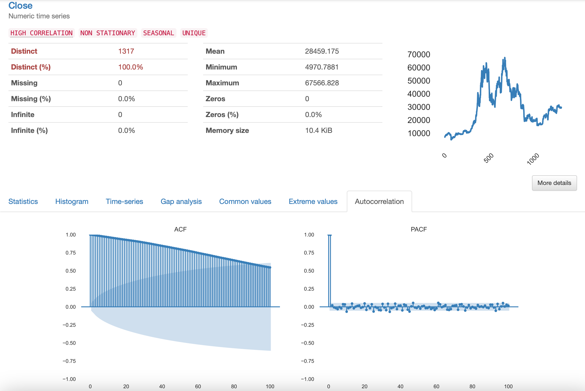
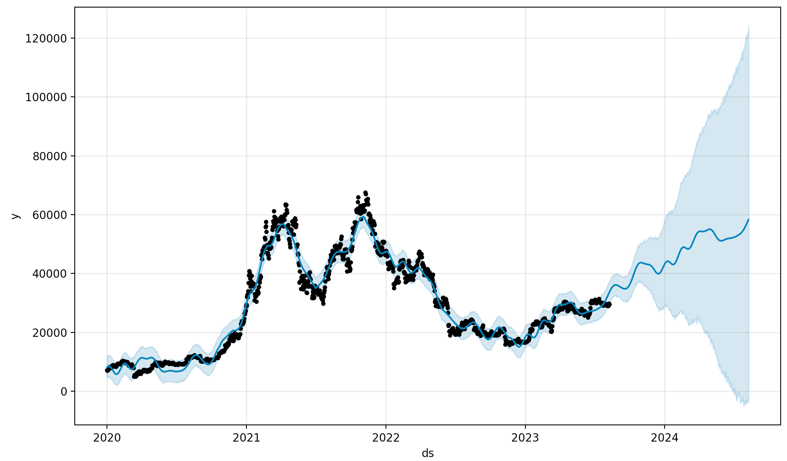
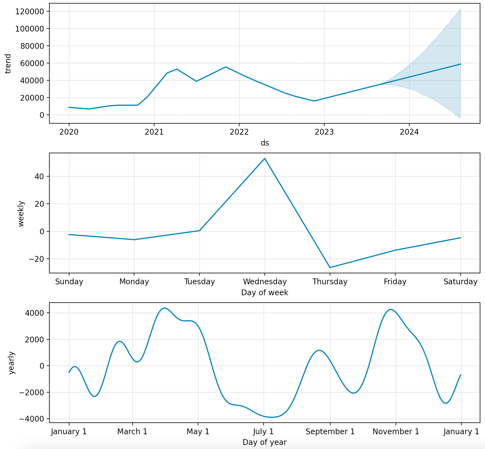
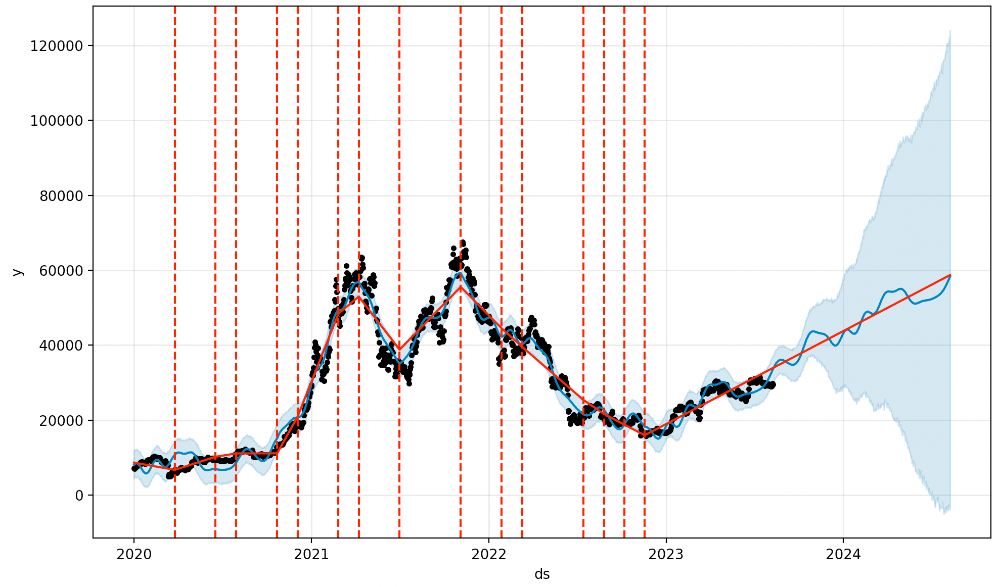

# Python의 Prophet과 ydata-profiling을 사용한 시계열 예측

## 왜 시계열 예측에 "약간 더 고급진"것이 필요한가?
주가 예측(Stock price prediction)을 필두로 유가, 선물, 옵션 등 다양한 금융상품에 대한 가격 예측은 수십년전부터 시도되어 왔고 현재까지도 수 많은 사람들이 시도하고 있습니다.  
특히 딥러닝 열풍 속에서 RNN/LSTM/GRU 등과 같은 Sequential model을 공부하게 되면 마법의 4단논법과 데이터 접근성을 바탕으로 한번쯤 시도해보는 주제가 바로 주가 예측입니다.

> <b>마법의 4단논법</b>
> 1. (MNIST 99%를 달성하며) 딥러닝 = 마법같은 예측력
> 2. RNN/LSTM = 순차 데이터 예측하는 딥러닝
> 3. 주식데이터 = 순차 데이터
> 4. 주가예측 가즈아!!
>
> *(Hello world  출력할 줄 안다고, 전문 프로그래머가 되었다고 생각하는 것과 같습니다.)*
  
그 결과로는 대부분 아래와 같은 결과를 가져오고는 합니다.*(야호! MSE 0.01! 나도 이제 워렌버핏!?!!??!)*  
이런 그림을 제가 수 많은 학부생 연구에서도 봤고, 블로그에서도 봤고, 사실 제 블로그에 있는 이전 포스트에서도 샘플데이터 구하기가 어려워서 묻고 더블로 갔고, 심지어 국내 탑스쿨에 유명한 교수님 랩에서도 이런 결과를 국내 학회에서 발표한것을 봤습니다.  

  
어려운 이야기를 할 필요도 없이, 빨간 선을 한두칸정도 왼쪽으로 옮기면 파란선과 동일해보이지 않습니까..?  
전혀 예측이 되고 있지 않고, 직전 값보다 조금 높은 값을 뱉어내고 있군요. 비슷한 사례로는 직전 값보다 조금 낮은 값을 계속 뱉거나 직전 값과 거의 동일한 값을 계속 뱉는 경우가 있습니다.  
우리는 가중 이동평균(Weighted moving average) 정도로도 동일한 효과를 낼 수 있는데 RNN이 필요한가요?

> |항목|딥러닝|이동평균|
> |------|:---:|:---:|
> |데이터가 적어도 작동하는가?|X|O|
> |모델 구축이 금방 되는가?|X|O|
> |구조가 단순한가?|X|O|
> |결과를 설명할 수 있는가?|X|O|
> |있어보이는가?|O|X|
>  
> *(굳이 뭐하러 RNN을...)*

저런 작업에 전기를 계속 쓰는건 지구에게도 좋지 않습니다...  
그래서 본 포스트에서는 **진짜 시계열 예측을 찍먹** 하는 방법을 짧게 알아보겠습니다.  

### 오늘의 준비물(Package)
- **ydata-profiling**: EDA를 지원하는 Python 패키지 (예전 이름인  pandas-profiling으로 널리 알려져있음)

> *"ydata-profiling primary goal is to provide a one-line Exploratory Data Analysis (EDA) experience in a consistent and fast solution. Like pandas df.describe() function, that is so handy, ydata-profiling delivers an extended analysis of a DataFrame while alllowing the data analysis to be exported in different formats such as html and json.  
(출처: [ydata-profiling 공식 페이지](https://ydata-profiling.ydata.ai/docs/master/index.html))"*

- **Prophet**: Facebook Core Data Science Team (현 Meta)에서 공개한 Seasonality 분석용 패키지

> *"Prophet is a procedure for forecasting time series data based on an additive model where non-linear trends are fit with yearly, weekly, and daily seasonality, plus holiday effects. It works best with time series that have strong seasonal effects and several seasons of historical data. Prophet is robust to missing data and shifts in the trend, and typically handles outliers well."  
(출처: [Peophet 공식 페이지](https://facebook.github.io/prophet/))*
  - Apple Silicon에서는 아래 명령어로 설치를 추천합니다

```bash
conda install prophet cmdstanpy==1.1.0 pystan==2.19.1.1
```

- yfinance: 야후 파이낸스에서 주식 등 금융상품 데이터 수집 목적 비공식 패키지

## 데이터 수집
- 비트코인 가격 데이터 수집 (간편하게 yfinance를 사용했지만, 네이버같은데서 엑셀로 가져와도 됩니다.)
- yfinance를 사용하면 pandas.DataFrame 형태로 불러와집니다.
- Column 명은 'Open', 'High', 'Low', 'Close', 'Adj Close', 'Volume' 입니다.
  - 순서대로 시가, 고가, 저가, 종가, 수정종가, 거래량 입니다.

```python
import yfinance as yf
df = yf.download('BTC-USD', start='2020-01-01', end='2023-08-10')
df.head()
```

```bash
                   Open         High  ...    Adj Close       Volume
Date                                  ...
2020-01-01  7194.892090  7254.330566  ...  7200.174316  18565664997
2020-01-02  7202.551270  7212.155273  ...  6985.470215  20802083465
2020-01-03  6984.428711  7413.715332  ...  7344.884277  28111481032
2020-01-04  7345.375488  7427.385742  ...  7410.656738  18444271275
2020-01-05  7410.451660  7544.497070  ...  7411.317383  19725074095

[5 rows x 6 columns]
```

## ydata-profiling을 사용한 데이터 탐색
- ydata-profiling은 EDA를 지원하는 패키지라고 말씀드렸는데, 간단한 Time series EDA도 지원합니다.
- 이전 포스팅에서 말한 것 처럼 stastsmodels로도 일일히 가능하지만,,굳이 모든 컬럼에 대해 각각 코드를 돌리기 보다는 이쪽이 훨씬 편하니까요.  
- 아래 코드를 실행하면 *"report_timeseries.html"* 라는 이름의 파일이 생깁니다.

```python 
import pandas as pd
from ydata_profiling import ProfileReport

df = df.reset_index()
profile = ProfileReport(df, tsmode=True, title="Time-Series EDA")

profile.to_file("report_timeseries.html")
```

### EDA 결과 탐색
#### Overview
- 몇가지 탭이 있는데, 전반적인 데이터 개요를 볼 수 있습니다.


- 특히 중요한건 Alerts입니다. 
- 뭐..사실 굳이 분석해보지 않아도 알 수 있는 내용이지만, 'Open', 'High', 'Low', 'Close', 'Adj Close' 등 다섯개 데이터는 전부 상관관계가 높은 데이터입니다.
- 종가(Close)를 기준으로 보면 비정상 시계열(Non-stationary)이고 계절성(Seasonality)이 있는 시계열이네요.
  - 다시한번 말씀드리지만, 시계열의 "정상성"은 Normality가 아닌 Stationary이며, 이는 데이터의 분산이 시간축과 관계없이 일정하다는 뜻입니다.



- 개별 변수에 대해 자세히 봅시다.
- 앞서 말씀드린, 상관관계/정상성/계절성에 대해 표시되어있고, 변수의 통계값, 히스토그램 등 도표들도 볼 수 있습니다.
- 혹시 ARIMA 등의 모형을 사용할 때 확인해줘야 하는 PACF, ACF등도 확인할 수 있네요.
  - 지난 포스팅과 동일하게 PACF를 보니 1차 차분을 하고 다시 한번 확인해야겠죠? *(오늘 사용할 Prophet에서는 안해도 됩니다.)*
  - 불필요한데 왜 했냐 하시면, 데이터를 분석하려면 그게 어떤 특성을 가진 데이터인지 알아야 하기 때문입니다.
  - 분석이 이상하다? 안된다? 하면 보통 데이터의 특성을 잘 모르고, 그냥 숫자를 남이 만든 패키지에 넣기만 했을때가 보통 그렇습니다.
- 이따가 모델의 결과가 이상하면 다시 이 내용을 보러 옵시다.

 

## Prophet 모델 구축
- Prophet 알고리즘으로 종가를 모델링해봅시다.
- 상세한 파라미터들이 많이 있지만 그건 [여기](https://facebook.github.io/prophet/docs/diagnostics.html#hyperparameter-tuning)를 참고하세요.

```python
from prophet import Prophet

df_renamed = df.rename(columns={'Date':'ds', 'Close':'y'})
model = Prophet()
model.fit(df_renamed)
```

- 예측은 아래 코드로 가능합니다.
- 미래 시점의 빈 pandas.DataFrame을 만들고, 모델로 해당 값을 채워넣는 방식입니다.

```python
future = model.make_future_dataframe(periods=365) 
forecast = model.predict(future)
```

- 예측결과를 담은 ```forecast```는 ```pandas.core.frame.DataFrame```타입 변수이기 때문에, 다양한 방법으로 시각화가 가능합니다.
- 기본적으로는 아래 방법으로 시각화가 가능합니다.

```python
import matplotlib.pyplot as plt

model.plot(forecast)
plt.show()
```

- 뭔가 예측스러운 느낌이 나긴 하네요..근데 과연 예측이 잘 된걸까요..?
    - 예측에는 2023/08/09 일까지의 데이터를 사용했습니다  
    (종가 29561.494141 USD/BTC).
    - 예측된 2023-08-10의 종가는 33798.379294 USD/BTC 입니다.
    - 실제 2023-08-10의 종가는 29429.591797 USD/BTC 이었습니다(yfinance 기준).
      - 약 10%이상 차이가 나는군요. 방향성도 틀렸습니다.
      - 역시 직접적인 예측은 불가능하다는 결론이네요.



- 예측 말고 해석적으로 접근해봅시다. 아래 코드로 시계열을 분해한 결과를 보겠습니다.

```python 
model.plot_components(forecast)
plt.show()
```

- 아래 그림을 보면, 순서대로 연도별 트랜드, 요일별 트랜드, 월별 트랜드입니다.
  - Prophet 모델에 대해 자세히 설명하지 않았지만(이미 널리 알려졌으므로..), 간단하게 말하면 연/월/요일 별로 시계열을 분해해서 앞으로의 시계열을 예측하는 모델입니다.
- 연도별로는 어떤 예측가능성이 보이는 것 같지는 않습니다만..해석적으로 접근하자면 코로나19 기간을 거치며 21년에 급등(1.5만불->5만불), 22년에 급락(5.5만불->2만불)했고, 현재시점에서는 다시 상승세에 있다..정도로 해석할 수 있겠습니다. 
- 요일별로는..왜인지는 모르겠는데 일/월/화요일에는 그다지 변동이 없지만 수요일에는 통상 50불정도 상승하는 편이고, 목요일에는 다시 하락하는(70불정도?) 경향이 있네요.
- 월별로 살펴보면 1분기(1~3월) 상승, 2분기(4~6월) 하락, 3분기 상승, 4분기 다시 하락의 패턴을 보입니다. 이렇게 3개월 단위로 명확한 패턴이 보이기도 쉽지 않은데..
  - 여름엔 코인 팔아서 휴가비라도 가시는 걸까요..?



- 이 외에도 예측 결과 시각화를 포함한 여러가지 기능들이 가능합니다.
  - Change point detection도 가능하고, Seasonal or Holiday effects를 추가하거나 Additional regressor를 붙이는 것도 가능합니다.

  ```python
  from prophet.plot import add_changepoints_to_plot
  fig = model.plot(forecast)
  a = add_changepoints_to_plot(fig.gca(), model, forecast)
  plt.show()
  ```
  


  - 마찬가지로 상세한 부분은 [여기](https://facebook.github.io/prophet/docs/quick_start.html)를 참고하세요. 포스트가 길어지기도 하고,,오늘은 약간만 더 고급지면 되기 때문에 여까지만 적겠습니다...😀

## 결론
- 분석 전에, 데이터에 대한 EDA는 당연히 해야한다.  
(의사가 진단도 안보고 수술부터 하지는 않는 것 처럼)
- Time series EDA는 개별적으로 봐도 좋지만, ydate-profiliing의 도움을 받으면 조금 더 편할 수 있다.
- Prophet은 그 목적이 '비 전문가가 사용할 수 있는 도구' 인 만큼 사실 통계적으로 막 따지지 않아도 사용할 수 있기는 하다.
- 그치만 통계적인 백그라운드를 가지고 전처리하면 더 잘 할수 있다. 
(스스로 자신감도 가질 수 있다.)