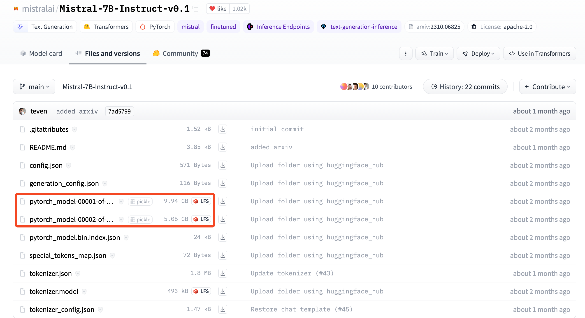
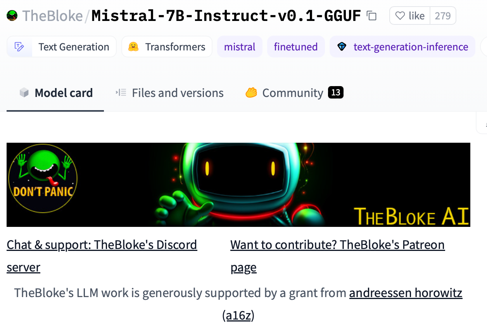
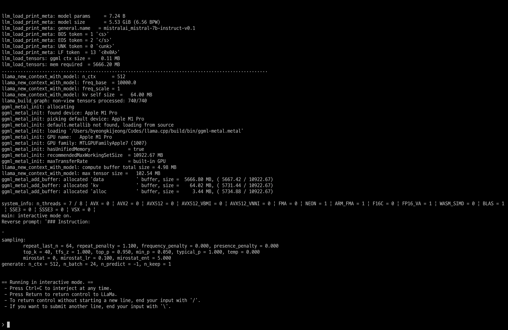
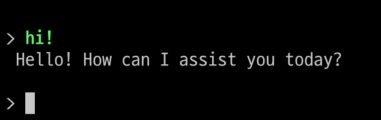

# LLM(Large Language Model)
LLM이 뭔지, 트랜스포머는 뭔지 등등은 설명하지 않겠습니다.  
다만 이름에 맞게 너무 무겁죠..파라미터 사이즈가 7B/16B/30B 등으로 구분되어 있지만, 가장 작은 모델도 Weight 파일만 십수기가에 육박합니다.  
(여담이지만 sLLM-Small Large Language Model 이라는 말 웃기지 않나요...)  

>작은걸로 유명한 Mistral-7B v0.1도 15기가...(9.94+5.06)

  

저는 16GB RAM을 가진, M1 pro 맥북 깡통을 씁니다. 근데 여기에서 LLM을 돌려보고 싶어서 몇가지 시도해 봤는데요.  
우선 대포적으로 Huggingface + Mistral 조합을 시도해 봤는데, 가상메모리까지 약 45기가쯤 쓰고 죽어버리더라구요.  
그래서 둘러보다, [요런](https://medium.com/@mne/run-mistral-7b-model-on-macbook-m1-pro-with-16gb-ram-using-llama-cpp-44134694b773) 글이 있길래 한번 따라해보고,
원 글에서 조금 불친절한 부분을 정리해보았습니다.  

# 어떻게 16GB 작은 메모리에 LLM을 올릴 수 있나?
관련해서는 [원글](https://medium.com/@mne/run-mistral-7b-model-on-macbook-m1-pro-with-16gb-ram-using-llama-cpp-44134694b773)을 참고하면 두가지 포인트가 있습니다.  
1. 양자화(Quantization): 모델 사이즈 줄이기 기본이죠, 쉽게말하면 Weight의 데이터 타입을 바꿔주는 것 입니다.
2. GGUF(GPT-Generated Unified Format): GPT와 같은 LLM을 빠르게 저장/불러오기 위한 바이너리 파일 포맷 입니다.

위 두가지를 통해, 상대적으로 저사양의 환경에서도 간단히 LLM을 돌려볼 수 있습니다.

# 어떻게 하는데?
간단히 세 단계로 가능합니다.
양자화 된 저용량 Weight를 받고, 이를 구동하기 위한 라이브러리를 설치해서 실행하면 됩니다.

1. 양자화 된 Weight를 다운받는다.
2. llama-cpp 라이브러리를 빌드한다.
3. 구동😀!

## 1. 양자화 된 Weight를 다운받는다.
저는 원글과 마찬가지로 Mistral로 할건데요.  
The Bloke AI 에서 여러가지 버전으로 양자화 된 Mistral의 Weight를 공유하고 있습니다.  
저는 [mistral-7b-instruct-v0.1.Q6_K.gguf](https://huggingface.co/TheBloke/Mistral-7B-Instruct-v0.1-GGUF/resolve/main/mistral-7b-instruct-v0.1.Q6_K.gguf?download=true) 를 다운받았습니다.

> Completion 모델은 [여기](https://huggingface.co/TheBloke/Mistral-7B-v0.1-GGUF)에서,  
> Instruct 모델은 [여기](https://huggingface.co/TheBloke/Mistral-7B-Instruct-v0.1-GGUF)에서 다운받으실 수 있습니다.  
> 

## 2. llama-cpp 라이브러리를 빌드한다.
llama-cpp는 GGUF 포맷의 파일을 구동하기 위한 라이브러리 입니다. 이름에서 보이실만큼 처음에는 LLaMa를 구동하기 위해서 만들어진 것 같고, C++로 짜여진것 같지만,,,어쨌든 그걸 Python에서 쓰기 위한 라이브러리입니다.

bash에서 아래 명령어를 순서대로 입력하시면 됩니다.  
대충 보시면 아시겠지만, github에서 복사해와서, Apple silicon에 맞게 빌드하는 것 뿐입니다.  
빌드 이후 llama-cpp 폴더 아래에 **./build/bin/main**이 생성되었다면, 정상적으로 빌드 된 것입니다.
```bash
git clone https://github.com/ggerganov/llama.cpp
cd llama.cpp
mkdir build
cd build
cmake .. -DCMAKE_APPLE_SILICON_PROCESSOR=arm64 
make -j
```

## 3. 구동😀!
1번에서 다운받은 .gguf 파일을, 적당한 경로로 옮겨줍니다.  
저는 **llama.cpp** 폴더 아래 **weights** 폴더에 넣어두었습니다.  

   
그러면, llama-cpp도 잘 빌드 되었고, weight파일도 잘 존재한다면, 아래 명령어로 실행이 가능합니다.  
(중간에 weight 경로는 알아서 수정해주세요 ✍️)

```bash
./build/bin/main --color --model "./weights/mistral-7b-instruct-v0.1.Q6_K.gguf" -t 7 -b 24 -n -1 --temp 0 -ngl 1 -ins
```

그러면 아래와 같이 실행 됩니다. 


인사도 잘 받아주네요.


### 3+@. Python 챗봇으로 만들기(원글에 없는 내용!😁)
LLM의 활용성에서 핵심은 Context 입력이라고 생각합니다.  
이전의 대화를 입력해서 문맥을 파악하게 하는 능력인데요.

Mistral의 Prompt Template은 사용자의 명령어는 ```[INST]```와 ```[/INST]```로 감싸고, 이전 대화는 ```<s>```와 ```</s>```로 감싸면 됩니다.  
```python
text = """
<s>[INST] What is your favourite condiment? [/INST]
Well, I'm quite partial to a good squeeze of fresh lemon juice. </s>
[INST] Do you have mayonnaise recipes? [/INST]"""
```
  

> (```<s>```와 ```</s>```는 각각 Begin-of-string, End-of-string을 의미하는데, 이전대화를 감싸는게 맞는지는 확인이 필요합니다.. 제대로 된 설명을 찾지 못했는데 대부분 예시가 그런식으로 감싸길래 일단 그런가보다 하는 중입니다.)

OpenAI의 GPT API를 써보신 분이라면 아실텐데, 거기에는 System / User / Assistant로 Role의 종류가 구분되어 있습니다.  

Mistral에는 User(=INST) / Assistant만 있지만, 사전에 몇가지 Context를 정의해두면, 유용하게 활용할 수 있습니다.  

예를 들어, 코드에 아래와 같은 내용을 미리 넣어두면, 한국어를 주로 이야기 하는 LLM이 됩니다.  
(물론 성능이나 추론시간은 영어가 훨씬 낫더라구요. 한국어는 추론시간이 기하급수적으로 길어지는 것 같습니다.)

```Python
text = """
<s> [INST] You are a native speaker of korean. Now you only response with korean. [/INST]
네, 저는 이제부터 한국어로 이야기 합니다.
"""
```

추가적으로, 아래 코드를 별도 파일로 만들어두고 bash에서 실행하면, 앞 Context를 기억하는 상태로 챗봇을 만들 수 있습니다.


```python
from llama_cpp import Llama
model = "./weights/mistral-7b-instruct-v0.1.Q6_K.gguf"
llm = Llama(model_path=model, n_ctx=8192, n_batch=512, n_threads=8, n_gpu_layers=2, verbose=False, seed=1004)

messages = []

base_message = """
<s> [INST] You are a native speaker of korean. Now you only response with korean. [/INST]
네, 저는 이제부터 한국어로 이야기 합니다.
"""

while True:
    user = input("메시지를 입력해주세요(-1: end, 0: clear): ")
    if user == '-1': break
    if user == '0': 
        messages=[base_message]
        continue
    message = '\n'.join(messages) + '</s>'
    messages.append(f"[INST] {user} [/INST]")
    output = llm(message + messages[-1], echo=True, stream=False, max_tokens=4096)
    print(output['usage'])
    output = output['choices'][0]['text'].replace(message + messages[-1], '')
    print(output)
    system = output
```